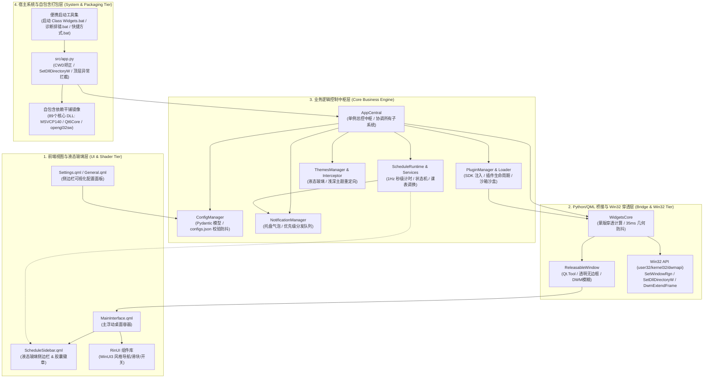
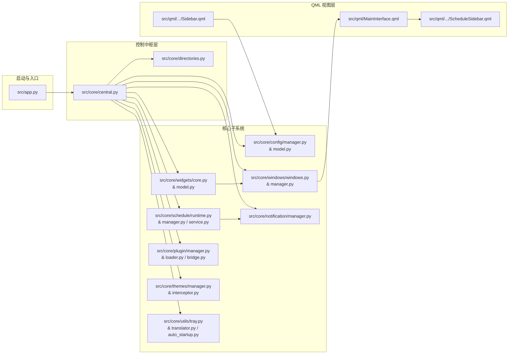
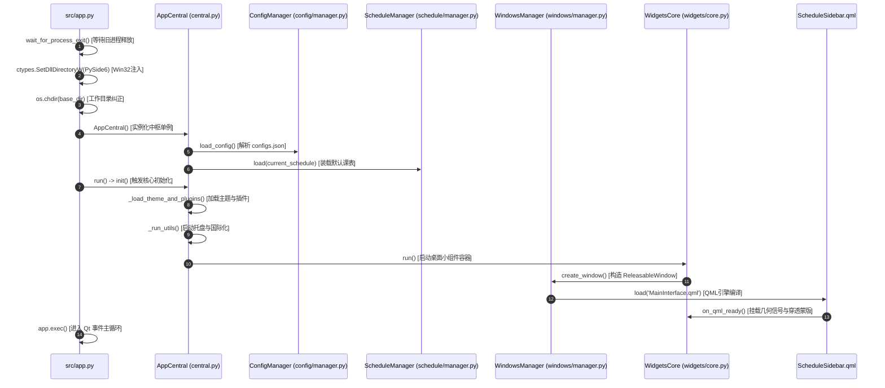
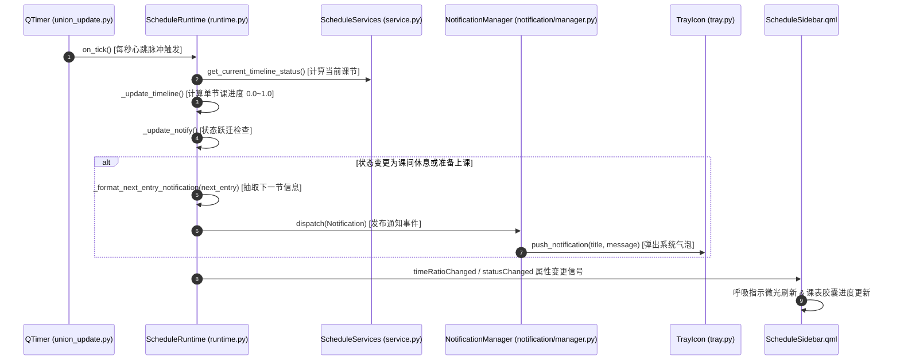
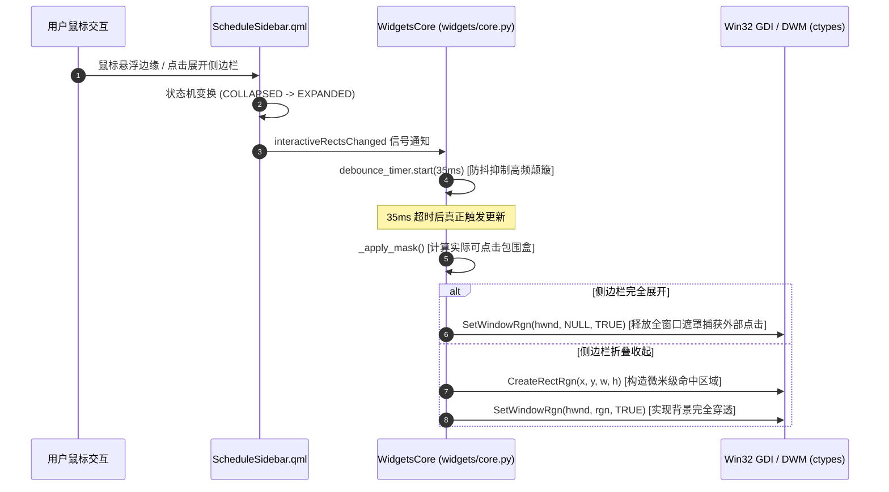
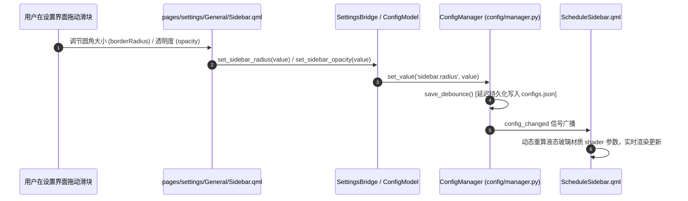

# Class-Widgets-2 全景系统架构设计与依赖拓扑权威指南 (System Architecture & Topology Guide)

> **生成时间**：2026-09-07  
> **项目仓库**：[https://github.com/shuoYun114/Class-Widgets-2-Custom](https://github.com/shuoYun114/Class-Widgets-2-Custom)  
> **技术基石**：Python 3.11/3.13 + PySide6 (Qt 6.7+) + QML/QtQuick + RinUI + Win32 API + PyInstaller

---

## 一、 全景分层系统架构图 (Full-Tier System Architecture)

本项目采用清晰的四层解耦架构：**视图着色器层**、**Python/Qt 原生桥接层**、**核心中枢调度层**、以及**系统与自包含运行层**。系统架构图如下：

---

## 二、 全项目目录与文件权责矩阵 (Directory & File Responsibility Matrix)

以下为本项目每一个物理目录及其全部核心文件的权责定义表：

| 目录 / 路径 | 核心文件 / 模块 | 核心职责与设计目的 |
| :--- | :--- | :--- |
| `src/` | `app.py` | **程序总启动入口**。注入 Win32 DLL 搜索目录、矫正工作目录、检测解压完整性、拦截未捕获顶层崩溃弹窗。 |
| `src/core/` | `central.py` | **核心调度中枢 (AppCentral)**。负责组织配置、窗口、课表、插件、通知、主题所有子系统的初始化与生命周期。 |
| `src/core/` | `directories.py` | **系统路径中心**。提供跨平台数据存储、日志、缓存、配置、资源等绝对物理路径的单例解析。 |
| `src/core/` | `platform.py` | **操作系统抽象层**。封装 Windows / Linux / macOS 底层平台差异检测与系统属性抽象。 |
| `src/core/` | `theme_recovery.py` | **主题安全恢复器**。在主题损坏或缺失时自动安全回退至系统默认安全样式。 |
| `src/core/config/` | `manager.py, model.py` | **全局配置中心**。基于 Pydantic 的严格类型配置持久化模型，提供磁盘防抖写入与全局信号通知。 |
| `src/core/schedule/` | `runtime.py` | **课表运行时主循环**。秒级心跳驱动，计算当前节次状态、课程时间进度条、抽离公共下一节课通知文本。 |
| `src/core/schedule/` | `manager.py, model.py` | **课表数据管理**。多课表 JSON 读写校验、结构升级、当前活动课表热切换。 |
| `src/core/schedule/` | `service.py, swapper.py` | **排课算法与调课服务**。周历跨天计算、科目查询、临时调课置换记录引擎。 |
| `src/core/schedule/` | `editor.py` | **课表可视化编辑引擎**。为设置页面的可视化排课器提供增删改查与合法性约束校验。 |
| `src/core/widgets/` | `core.py` | **小组件管理与异形穿透核心**。基于 Win32 `SetWindowRgn` 维护异形窗口穿透蒙版，35ms 几何防抖。 |
| `src/core/widgets/` | `model.py` | **桌面小组件预设数据模型**。定义组件位置、长宽、吸附边缘与层叠预设。 |
| `src/core/windows/` | `windows.py, manager.py` | **窗口管理器**。封装 `ReleasableWindow` 窗口类，实现无边框悬浮、透明背景与多窗口句柄管理。 |
| `src/core/plugin/` | `manager.py, loader.py` | **插件总控与安全加载器**。扫描本地/内置插件，向运行时注入 `ClassWidgets.SDK`，调用生命周期。 |
| `src/core/plugin/` | `bridge.py, components.py`| **插件跨语言桥梁**。支持 Python 插件向 QML 注册后端对象、快捷方式与自定义桌面组件。 |
| `src/core/plugin/` | `api.py, models.py` | **开放 SDK 接口与元数据**。向插件开发者暴露稳定的公共 API，解析 plugin.json 权限配置。 |
| `src/core/themes/` | `manager.py, loader.py` | **主题管理系统**。提供液态玻璃、深色模式、浅色模式切换与 QML 资源动态搜索路径维护。 |
| `src/core/themes/` | `interceptor.py, model.py`| **主题资源拦截器**。捕获 QML 资源请求并动态解析到当前激活主题的真实物理目录。 |
| `src/core/automations/`| `manager.py, base.py` | **后台任务调度框架**。管理定时心跳轮询任务（如自动隐藏、版本检查、插件广场同步）。 |
| `src/core/automations/`| `update_check.py` | **软件更新检查器**。异步轮询 GitHub Release API，发现新版本推送托盘消息。 |
| `src/core/notification/`| `manager.py, provider.py`| **桌面通知总线**。管理通知优先级队列，分发课程开始、下课、活动与系统公告弹窗。 |
| `src/core/plaza/` | `client.py, bridge.py` | **插件市场客户端**。负责与在线插件广场进行 HTTP 通信、检索、下载与元数据解析。 |
| `src/core/updater/` | `updater.py, downloader.py`| **应用热更新器**。负责增量下载、解压并平滑替换应用程序二进制文件。 |
| `src/core/utils/` | `tray.py` | **系统托盘管理器**。管理系统通知区图标、托盘菜单、左键交互与气泡消息分发。 |
| `src/core/utils/` | `translator.py` | **多语言国际化**。支持 zh_CN、en_US、ja_JP 动态热切换，无需重启程序。 |
| `src/core/utils/` | `auto_startup.py` | **开机自启助手**。读写 Windows 注册表 Run 键，支持开机静默常驻后台。 |
| `src/core/utils/` | `instance_locker.py` | **单实例互斥锁**。基于 Windows 命名管道/文件锁防止重复多开并激活已有窗口。 |
| `src/plugins/` | `cw_widgets/widgets.py` | **官方内置组件插件**。提供时钟、课表卡片、倒计时等官方开箱即用小组件。 |
| `src/qml/` | `ScheduleSidebar.qml` | **苹果液态玻璃侧边栏核心**。全天课程一屏平铺、胶囊微章、呼吸指示灯、响应式折叠展开。 |
| `src/qml/` | `Settings.qml / Sidebar.qml`| **可视化设置面板**。提供侧边栏位置、圆角大小、透明度调节滑块，实时双向绑定。 |
| `scripts/` | `build_exe.py` | **全自包含打包流水线**。整合 PyInstaller、--noupx 保护、89 个 DLL 根目录镜像与启动脚本生成。 |
| `scripts/` | `qt_files_clean-Windows.json`| **Qt 依赖裁剪白名单**。移除 3D/WebEngine 等未引用大模块，保留核心与 opengl32sw。 |
| `assets/` | `images/, fonts/` | **静态资源目录**。存放应用程序图标、托盘图标、徽标与矢量字体。 |
| `configs/` | `configs.json` | **持久化配置存储**。存放用户全部个性化设置、侧边栏位置与圆角参数。 |
| `tests/` | `test_sidebar_*.py` | **自动化测试套件**。涵盖配置模型、遮罩几何、课表数据与全天多场景验证（134 个全绿通过）。 |

---

## 三、 文件间依赖拓扑路线图 (File-Level Dependency Flow)

系统的模块导入与数据流依赖严格自顶向下，严禁逆向耦合：

---

## 四、 核心业务函数调用依赖路线 (Function Call Routes)

以下为系统中 5 大关键业务流程的真实函数调用轨迹：

### 1. 系统完整启动与初始化函数链 (Bootstrapping Route)

### 2. 秒级课表推进与通知调度函数链 (1Hz Runtime Tick Route)

### 3. 侧边栏异形遮罩与穿透更新函数链 (Mask Penetration Route)

### 4. 侧边栏个性化参数配置联动函数链 (Settings Sync Route)

